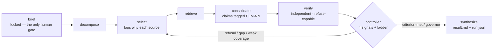
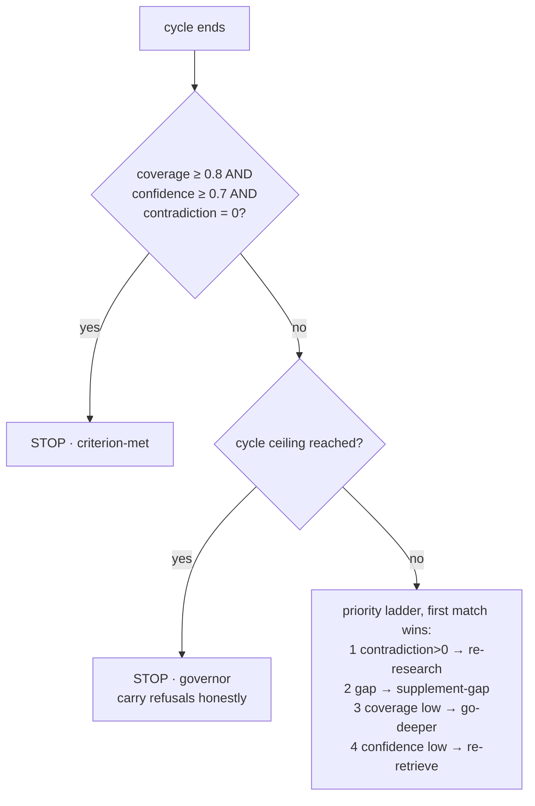

# research-engine

 

> A research engine that contests its own findings and shows its work — it can refuse a claim its own evidence does not support, and it records why it trusted each source.

**Status: stable snapshot, v1.** Built with Claude Code; issues and PRs are not actively watched. The full pipeline — including the refuse-capable verifier and the bounded control loop — runs end to end (see [a real example](examples/)). v1 is a deliberately scoped first version; [docs/architecture.md](docs/architecture.md) §6 is the canonical split of what ships now versus what is designed-not-yet-shipped.

## Why it exists

Most deep-research tools cite their sources but never argue with them, and none show why they trusted one source over another. `research-engine` turns two things into first-class, inspectable artifacts:

- **A refuse-capable adversarial verifier.** An independent agent re-fetches each cited source itself and can return *the evidence does not support this* — and a refusal forces the engine to re-research rather than synthesize over a weak claim.
- **A per-source selection-and-trust log.** For every source: why this one, why not the others, how fresh, how primary, how far trusted — written down, not buried in a tool call.

Both run open and reproducible over a stack of real, free public sources. The bet: as models commoditize, the durable layer is the inspectable verification-and-selection harness around them, not the model. This repo is that harness, built end to end so it can be read and re-run.

## How it works

A single human gate (the locked brief) is followed by an autonomous pipeline. A deterministic controller decides what happens after each cycle from explicit signals — never an opaque "the model decides" — and a depth/cycle governor guarantees the run terminates.



After each cycle the controller checks, in this fixed order:



Full mechanics — the four signals, the verifier's independence rules, the governor and reproducibility model — are in [docs/architecture.md](docs/architecture.md).

## What you bring / what you get

| You provide | You get back |
|---|---|
| A research objective and an output directory (a three-field brief; the engine interviews ≤5 questions for the rest). | The deliverable in the form you asked for, plus a complete trace tree: the decomposition, per-source selection logs, raw retrieval, a claim-tagged synthesis, the verifier's contestation, the controller's loop log, and a machine-readable `run.json`. |

## What the output looks like

Every statement in the deliverable traces to a contested-and-supported claim. When the evidence is not there, the engine says so rather than inventing a number — from the real example run (captured, unedited):

```markdown
## Market size: an honest gap, not a number

**The addressable market for SMB sales-call AI notetakers in Southeast Asia could
not be sized from open sources.** No published figure scoped to that specific
category — SMB, sales-call notetaker, Southeast Asia — was retrievable from the
free stack; the question is recorded as genuinely unanswered (CLM-31).
```

## Quickstart

```bash
git clone <repo-url> research-engine
cd research-engine
# Open the repo in Claude Code, then invoke the composer skill:
#   /research
# Answer the ≤5 intake questions (at minimum an objective and an output directory).
# The run is autonomous from the locked brief; the deliverable lands at:
#   <output_path>/<run-id>/synthesis/result.md
```

To reproduce the shipped example, feed its [`brief.md`](examples/20260625-135009-ai-notetaker-sea-gtm/brief.md) and compare against its `synthesis/result.md`. The OpenAlex and World Bank spine is exactly reproducible; open web pages may have drifted since the run, so web-sourced claims are *checkable* against the recorded query and URL.

## Configuration

The single config surface is the **brief** ([schema/research-brief.md](schema/research-brief.md)): three required fields (`objective`, `deliverable`, `output_path`) and a handful of recommended fields with defaults, all confirmed in the intake interview. There is no environment file and no hidden loader.

## Repository structure

```
research-engine/
├── README.md            what it is, what it proves (this file)
├── AGENTS.md            agent entry — orientation for an ingesting agent
├── CLAUDE.md            the same orientation, read by Claude Code
├── LICENSE              MIT
├── .claude/
│   ├── commands/        the skills — research (composer) + research-{verb} leaves
│   └── agents/          agent definitions, incl. the independent verifier
├── schema/
│   └── research-brief.md   the intake contract
├── docs/
│   ├── architecture.md  the settled design + the v1-vs-designed split (§6)
│   ├── conventions.md   naming, trace-tree, and identifier rules
│   └── source-catalog.md   the v1 selection knowledge base
├── examples/            a complete, real sample run (read in trace order)
└── runs/                your runs land here (gitignored)
```

## Design decisions

| Decision | Why | What it costs |
|---|---|---|
| Refuse-capable verification is the headline | Contestation that can *refuse* is an open problem incumbents don't ship; it is the engine's reason to exist | A refusal can force a re-research, so a run can cost more than one straight pass |
| Deterministic controller — computed signals + a fixed ladder, never "the model decides" | Inspectability is the proof; the routing is something anyone can read and audit | Less adaptive than an LLM meta-controller (documented as designed-not-shipped) |
| The verifier re-fetches each cited source itself | A self-check shares the author's blind spot; re-fetching catches citation–evidence mismatch (it did, on the real run) | Extra fetches; the independent corroboration is bounded to ≤1 query per claim |
| v1 ships three keyless sources — web, OpenAlex, World Bank | Every clean run is openly reproducible; a stranger can re-run it for free | Narrower coverage than the full ~95-source catalog (designed-not-shipped) |
| A depth/cycle-ceiling governor | Guarantees termination and affordable re-runs | A hard run can stop with a standing gap, carried honestly; a spend cap is recorded but not yet enforced |
| Ships as a Claude Code skill bundle, not a Python codebase | The form-factor it was built in; the composer-and-leaves shape gives the verifier its independence for free | "A stranger" who reproduces it means a Claude Code user, stated plainly rather than implied |

## Cost & limitations

- It runs inside Claude Code (the skill-bundle form-factor); "reproducible" means a Claude Code user can re-run it.
- Open web pages drift; only the OpenAlex and World Bank API spine is exactly reproducible. Web-sourced claims are checkable against the recorded query and URL.
- v1 is scoped: three keyless sources, a few cycles, one real refuse-capable verifier. The full adaptive controller, multi-round verifier, hard spend cap, and ~95-source catalog are designed-not-shipped ([docs/architecture.md](docs/architecture.md) §6).

## What this touches / where your data goes

The engine reads public web pages and the OpenAlex and World Bank public APIs — no authentication, no keys, no secrets. It writes the entire run trace to the `output_path` you choose, and sends nothing anywhere else.

## Non-goals

- Not a general agent framework, and not a hosted product.
- Not a citation-checker: it contests whether the evidence *supports* a claim, not merely that a quoted string exists.
- Not maintained for outside contributions — a stable snapshot, not a living project.

## FAQ

**Is the example a real run?** Yes — a live, unedited run; the verifier refused a real claim in cycle 1 and the controller re-researched. The one disclosed change is that `run.json` was later extended with the per-cycle grounding history the engine now records natively (`examples/README.md` says so).

**How is this different from existing deep-research tools?** They cite; this *refuses*, and it writes down why it trusted each source over the others.

**Does the controller let the model decide?** No. The model computes signal values (logged with their reasoning); the routing is a fixed priority ladder anyone can read.

**Why so few sources?** v1 is deliberately scoped to keyless sources so every run is openly reproducible. Breadth is the substrate, not the headline, and the full catalog is designed-not-shipped.

## Docs

- [docs/architecture.md](docs/architecture.md) — the settled design, the controller, the governor, and the v1-vs-designed split.
- [docs/conventions.md](docs/conventions.md) — naming, trace-tree layout, and the identifier scheme.
- [docs/source-catalog.md](docs/source-catalog.md) — the v1 selection knowledge base.

## License

[MIT](LICENSE). A stable v1 snapshot — reproducible and inspectable, not actively maintained.
